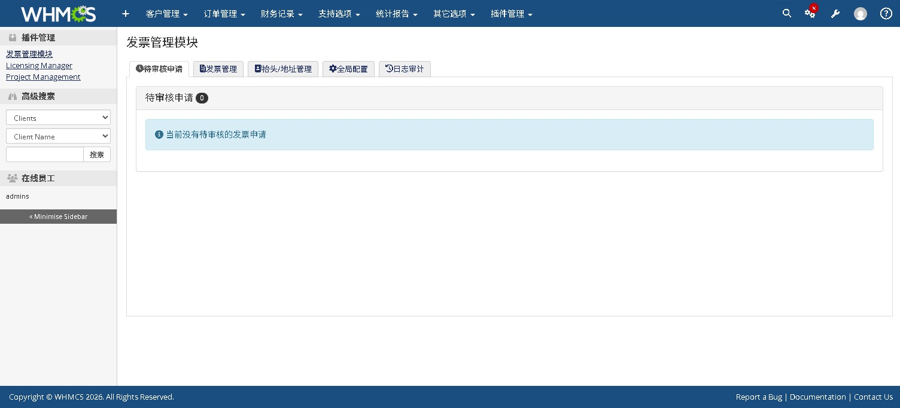
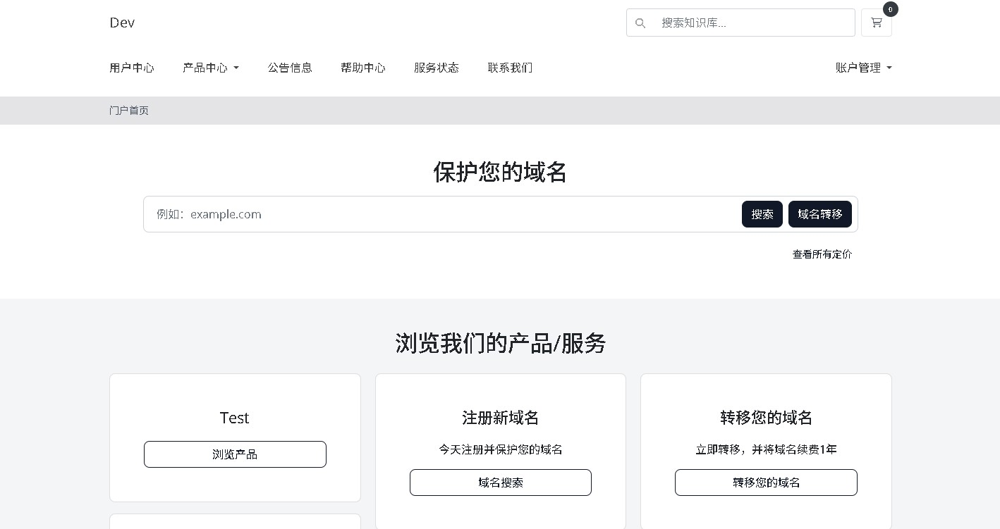

# WHMCS 简体中文语言包 (Simplified Chinese Language Pack)

### 📖 项目简介 / Intro

本项目提供 WHMCS 最新版本的深度本地化简体中文翻译，旨在解决官方默认翻译不准确、语境生硬等问题。翻译风格参考阿里云、腾讯云等主流云服务商，确保符合中国用户的操作习惯。

### ✨ 版本特性 / Version Features

* **深度兼容**：完美适配 **WHMCS v9.0.* 系列版本。
* **本地化优化**：针对国内 IDC 行业语境进行了大量词条修正（如：将“商店”优化为“产品中心”，“服务监控”优化为“服务状态”）。
* **移除追踪**：本项目关注隐私，内含移除后台 Mixpanel 和 Retently 追踪代码的解决方案。
* **持续更新**：跟进 WHMCS 8.11+ 后的自然排序逻辑，结构清晰。

### 🚀 安装使用 / Using

1. **下载本项目**：点击 `Code` -> `Download ZIP` 或使用 `git clone`。
2. **上传文件**：将 `chinese.php` 上传至 WHMCS 安装目录的相应位置：
* **前台语言包**：`/lang/overrides/`（推荐，可防止程序升级被覆盖）
* **后台语言包**：`/admin/lang/overrides/`

3. **切换语言**：在 WHMCS 后台 `Setup` -> `General Settings` 或用户中心切换为 `Chinese`。

### 🖼️ 界面预览 / Screenshots

| 后台管理界面 (Admin Area) | 用户中心 (Client Area) |
| :--- | :--- |
|  |  |
> *注：截图基于 WHMCS v9.0 默认主题 (Blend/Twenty-One) 制作。*

### 🛠️ 开发工具 / Developer Tools

在 `src/` 目录下提供了一个小工具：

* **`repare.php`**：用于读取原始语言包、重新进行自然排序、写入新文件并辅助编译翻译。适合开发者在 WHMCS 大版本更新后快速重构语言文件。

### 💡 参与改进 / Contribution

翻译工作量巨大，虽然已经过多次校对，但难免存在疏漏或语境不当之处。

* **提交反馈**：如果你发现翻译不准、错别字或有更好的本地化建议，请直接 [提交 Issue](https://github.com/hostsoft/whmcs-chinese-lang) 反馈。
* **贡献代码**：欢迎提交 Pull Request (PR) 参与完善。
* **联系作者**：如有业务交流，请访问 [IDCSOFT.NET](https://idcsoft.net)。

---
**如果这个项目对你有帮助，欢迎点个 ⭐ Star 给予支持！**

### 📝 注解 / Notes

> **注意**：自 WHMCS 8.11 版本起，官方重构了语言文件的索引逻辑。本项目已针对新的自然排序进行整理，解决了以往翻译文件中词条混乱、重复等问题。

### 🤝 关于 / About

由 **IDCSOFT.NET** 维护。我们致力于为中文 WHMCS 用户提供高质量的本地化支持。

### 📄 许可 / License

基于 **GPL** 协议开源。
*您可以自由使用、修改及分发本项目，转载或二次发布请保留原作者来源链接！*
